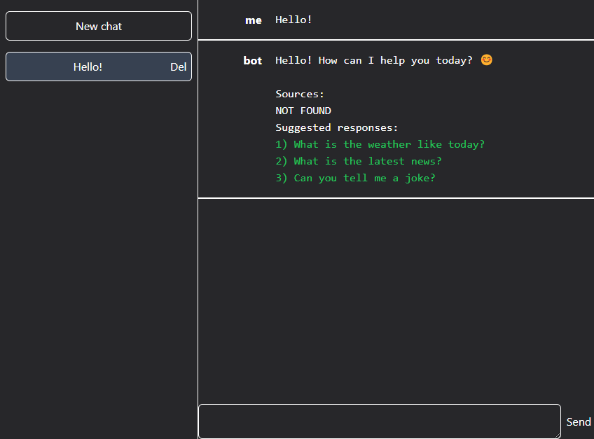

# BotBingAIApp

BotBingAIApp is a web application that allows users to interact with a neural network powered by Microsoft's Bing. This application is similar to a chatbot, and users can make requests to the neural network by typing in their queries.

## Screenshots



## Installation

First you need to install all the dependencies to run this project. But first make sure you have Node js installed.
To do this, open a command prompt or terminal and type the following commands:

```bash
node -v
```
```bash
npm -v
```

If you are using the pnpm package manager, then run this command:

```bash
pnpm -v
```

After that, go to the folder with this project and run the following command:

```bash
npm install
```
Or
```bash
npm i
```

If you are using the pnpm package manager, then run this command:

```bash
pnpm install
```
Or
```bash
pnpm i
```

To authenticate with the Bing API and make requests to the neural network, users must provide a valid cookie in the form of a `COOKIE=YOUR_COOKIE` string. To do this, create a `.env` file in the root directory of the project and add the `COOKIE` variable with your cookie value. This will allow the application to authenticate with the Bing API and make requests to the neural network.

Note that the `COOKIE` value should not be shared with anyone else, as it grants access to your Bing account. Keep this value secure and private.

## Usage

After installing the dependencies, use the following command to run, depending on the package manager you are using:

```bash
npm run start
```
Or
```bash
pnpm start
```

After launching, copy and paste the following url into the address bar:

[http://localhost:3000](http://localhost:3000)

Once you are in the application, you can start chatting with the neural network by typing in your queries. All of your requests and chats will be saved to JSON files for later reference.

## Contributing

If you would like to contribute to BotBingAIApp, please fork the repository and make any necessary changes. Once you have made your changes, submit a pull request and we will review your changes.

## Authors

- [Dmitriy303](https://github.com/rusnakdima)

## License

This project is licensed under the [License Name](LICENSE.MD).

## Contact

If you have any questions or comments about this project, please feel free to contact us at [contact email](rusnakdima03@gmail.com).